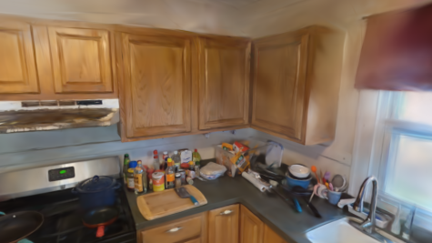

# AV-GS: (NeurIPS 2024 Anonymous submission)

## Demo
The below video shows the rendered binaural audio for 6 different positions (unseen during training) for the "house" scene from the RWAVS dataset.
For each position we visualize the context feature vector for each point in the learned scene representation. For reference, we also show the RGB camera view (bottom right).
Please notice the change overall amplitude (distance awareness) as well in the left and right channels (direction awareness) as we toggle across the 6 positions in the video.

<video width="100%" controls>
  <source src="assets/audio/avgs_6positions_house_scene.mp4" type="video/mp4">
  Your browser does not support the video tag.
</video>

In this video, you can see and hear the ambient sounds across the house as the position changes.
